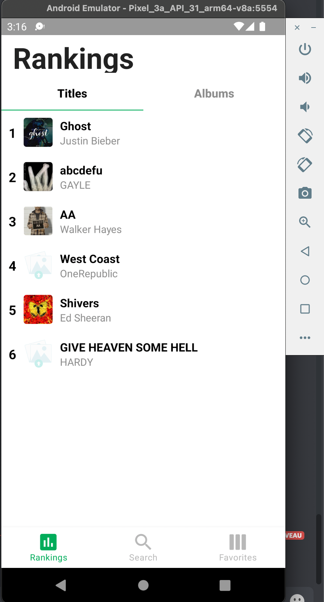
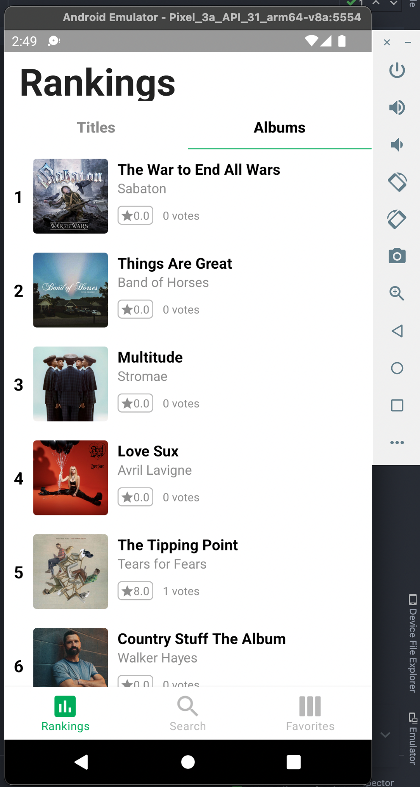
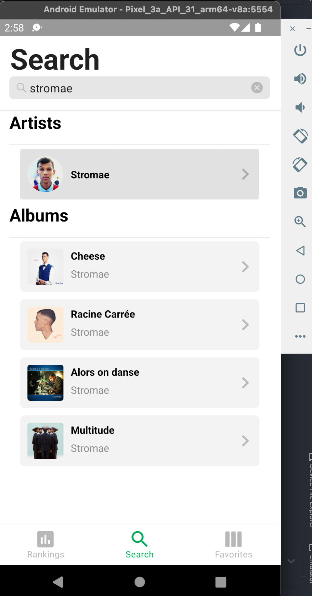
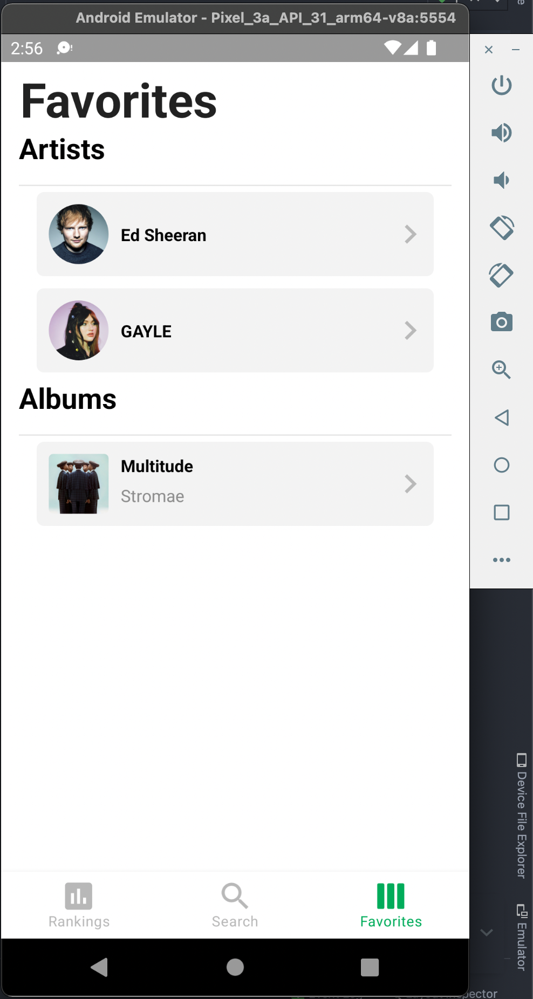
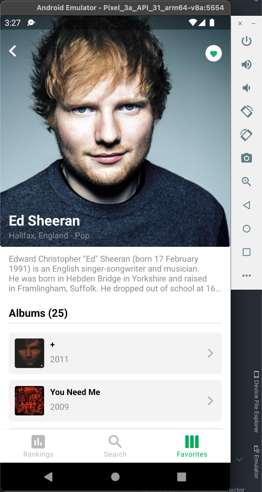
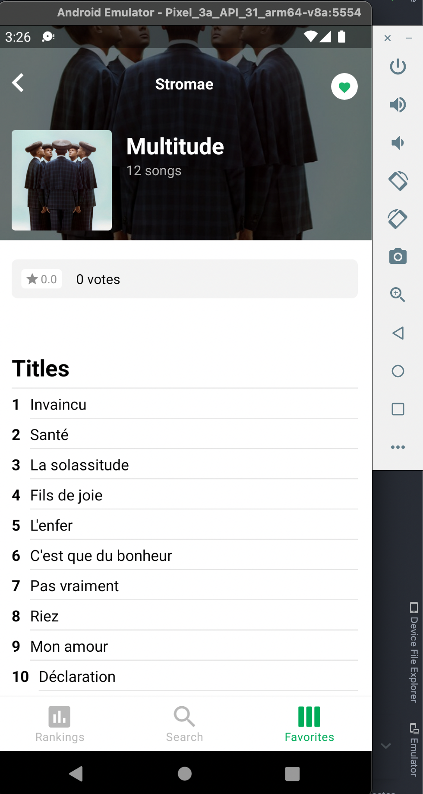
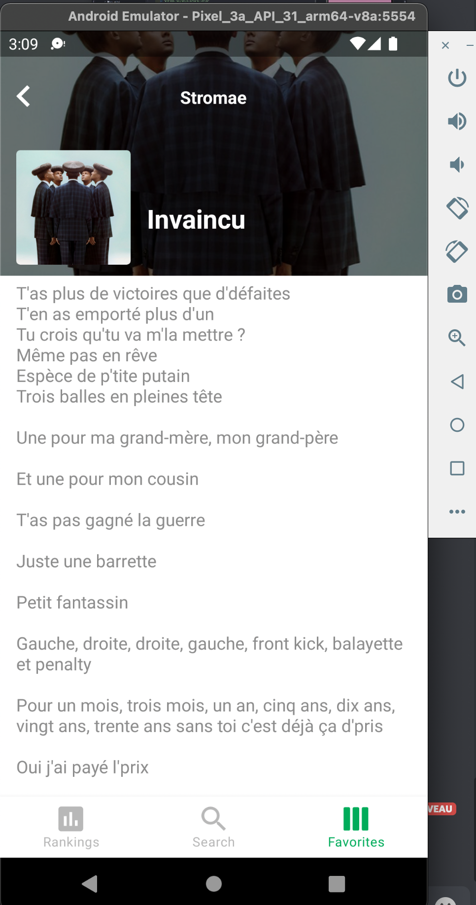

# Audiolly

## L'application

L’application fonctionne sur Android 5.0 et plus.

Elle a été développée uniquement en Kotlin.

On a utilisé les API de [TheAudioDB](https://theaudiodb.com/api_guide.php) pour les rankings, les titres, les albums, les artistes ...

Mais aussi l'API [api.lyrics.ovh](https://lyricsovh.docs.apiary.io/#) pour les lyrics. (BONUS)

## Fonctionnalité

- Page d’accueil avec onglets
- Classements (charts) des singles & albums
- Fonction de recherche d’un artiste
- Liste des artistes favoris
- Détails d’un artiste
- Fonction de mise en favoris d’un artiste
- Détails d’un album
- Gestion des traductions
- Persistance des données
- Fonction de mise en favoris d’un album
- Liste des favoris : supporter les albums
- Fonction de recherche : supporter la recherche par album

### Fonctionnalités bonus

- Ecran avec les paroles d’une chanson
- Utilisation du debounce pour le champ de recherche
- Fonction de mise en favoris d’un album
- Les music dans les albums redirige vers la page paroles

## Architecture de l'application

```code
src/
├─ api/
│  ├─ response/
│  ├─ {{interactor}}
├─ features/
│  ├─ {{feature1}}
│  ├─ {{feature2}}
│  ├─ {{feature3}}
│  │  ├─ {{fragment.kt}}
├─ models/
│  ├─ {{data class}}
├─ storage/
├─ MainActivity.kt
```

### API

Dans le package API on stock nos DTO (data transfer object) dans le dossier response, et on a des interactors pour communiqué avec les différentes API.

### Features

Pour chaque fonctionnalité de l'application on a utiliser un sous dossier dans le dossier features qui contient les fragments et autre élément de la fonctionnalité en question.

### Models

Pour chaque objet "métier" de l'application on a un model associé qui se trouve dans le dossier model (qui est sous la forme de data class).

### Storage

Dans le dosier storage on stock les informations liée a la base de donnée local SQLite.

On utilise des DAO (data access objet) pour accèder a nos données comme le veut la librairie **room**.

La persistance des données nous permet de récuperer les informations au chargement.

## Quelques images








### BONUS


